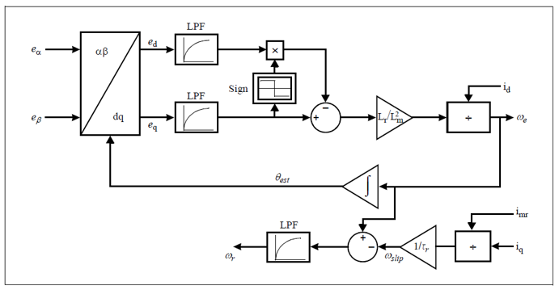

 

# MCHV3 DSPIC33CK256MP508 AN1206

## INTRODUCTION

The requirement of low-cost, low maintenance, robust electrical motors has resulted in the emergence of the AC Induction Motor (ACIM). The AC Induction Motor (ACIM) is the workhorse of industrial and domestic motor applications due to its simple construction and durability. These motors have no brushes to wear out or magnets to add to the cost. The induction motors are available in a variety of power and sizes.

The control of induction machines can be classified into ‘scalar (v/f)’ and ‘vector’ controls. Scalar controls are simple to implement and offer good steady-state response. However, the dynamics are slow because the transients are not controlled. To obtain high precision and good dynamics, the Field Oriented Control (FOC), also known as vector control, provides the best solution. Flux position information is required to implement vector control. Using position/speed sensors may result in many practical problems, such as complexity of hardware, difficulties in application meant for hostile environments, increased cost, reduced reliability due to the cables and sensor itself, difficulties of mechanical attachment of the sensor to the electric machine, increased axial length of the machine and electromagnetic noise interference. These problems with a physical sensor can be mitigated by estimating the speed/ position information (sensorless FOC).

The intent of this application note is to present sensorless Field Oriented Control (FOC) of a three-phase AC Induction Motor using a PLL estimator.

  

### SPEED AND ANGLE ESTIMATOR

A Phase-Locked Loop (PLL) estimator is implemented to estimate the speed and position of the rotor flux. Back-Electromagnetic Force (Back-EMF or BEMF) is used for estimating the speed and position of the rotor flux. When rotor flux is oriented along the d-axis, then the d-component of BEMF (ed) would be equal to 0. The estimator algorithm operates on the principle that the steady-state value of the d-axis component of the Back-EMF is equal to zero. This estimator implementation is similar to the PLL estimator employed in Microchip Application Note: AN1292, “Sensorless Field Oriented Control (FOC) for a Permanent Magnet Synchronous Motor (PMSM) Using a PLL Estimator and Field Weakening (FW)”. The block diagram of the PLL estimator is shown in Figure below.

  

- Readme document for External op-amp configuration [Readme for External Op-Amp](mchv3_dspic33ck256mp508_an1206/docs/README_external.md)
- Readme document for Internal op-amp configuration [Readme for Internal Op-Amp](mchv3_dspic33ck256mp508_an1206/docs/README_internal.md)