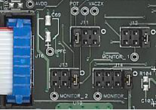
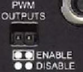

 

# AN1206 Demonstration ReadMe for the dsPICDEM™ MCHV-2 Development Board or dsPICDEM™ MCHV-3 Development Board with the dsPIC33CK256MP508 External Op-Amp Motor Control PIM(MPLAB® X IDE)

## INTRODUCTION

This document describes the setup requirements for running the Sensor-less FOC algorithm for an Induction Motor, which is referenced in AN1206 “Sensorless Field Oriented Control (FOC) of a Three-Phase AC Induction Motor (ACIM)” 

The demonstration is configured to run on either the dsPICDEM™ MCHV-2 Development Board or the dsPICDEM™ MCHV-3 Development Board in the External Op-Amp configuration with the dsPIC33CK256MP508 Internal Op-Amp Motor Control Plug-In Module (PIM).

## Hardware Connection and Running the Demo Code

## Motor Control Application Firmware Required for the Demonstration
To clone or download this application from Github, go to the [main page of this repository](https://github.com/microchip-pic-avr-solutions/mchv3-dspic33ck256mp508-an1206) and then click Clone button to clone this repository or download as zip file.

## Software Tools Used for Testing the firmware
- MPLAB® X IDE v5.50
- MPLAB® XC16 Compiler v1.70
- MPLAB® X IDE Plugin: X2C-Scope v1.30
> **_NOTE:_**
>The software used for testing the firmware prior to release is listed above. It is recommended to use the version listed above or later versions for building the firmware.
## Hardware Tools Required for the Demonstration
To set up the demonstration, you may use one of the High-Voltage Motor Control Development Boards mentioned below:
- dsPICDEM™ MCHV-2 Development Board, Part-No. [DM330023-2](https://www.microchip.com/en-us/development-tool/dm330023-2)
- dsPICDEM™ MCHV-3 Development Board [DM330023-3](https://www.microchip.com/en-us/development-tool/dm330023-3)
> **_NOTE:_**
>In this document, hereinafter High-Voltage Motor Control Development Board selected for setting up the demonstration is referred as Development Board..
- High Voltage 3-Phase AC Induction Motor, Part-No. [AC300023](https://www.microchip.com/en-us/development-tool/AC300023)  
- dsPIC33CK256MP508 Internal Op-Amp Motor Control Plug-in module, Part-No. [AC300023](https://www.microchip.com/en-us/development-tool/MA330041-2)
 

> **_NOTE:_**
> All items listed under the section Hardware Tools Required for the Demonstration are available at [microchip DIRECT](https://www.microchipdirect.com/)

## Hadware Setup

This section describes hardware setup required for the demonstration. Motor phase current feed-backs needed by the firmware are amplified by the operational amplifiers that are External to the dsPIC33CK256MP508. This is referred as ‘External amplifier configuration’.

Refer dsPICDEM™ MCHV-2 Development Board User’s Guide or dsPICDEM™ MCHV-3 Development Board User’s Guide, for any clarification while setting up the hardware.

1.  Before making any connection, verify that the Development Board is not powered and it is fully discharged. This can be done by checking if Power on Status LED D13(Red) is off.

 
2.  Open the top cover of the enclosure and set up the following jumpers (if they are not in specified positions):
 

| Jumper|Pins to Short|Board Reference |Remarks|
| :--------:| :-----------:|:-----------------:|:---------------:|
|J11        |3-4 | |These Jumpers are present on the Development Board. These can be accessed only after opening the top cover of the enclosure.|
|J12|1-2|||
| J12   | 1-2   | ||
| J14   | 1-2 | ||
| PWM OUTPUTS   | ENABLE position | |These Jumpers can be accessed without opening the enclosure, from the front side of the board(or enclosure).|
| USB   | FOR USB position | ||
 

  

3.  Connect the three phase wires from the motor to M1, M2, and M3 terminals of connector J17(there is no specific order), provided on the Development Board..

  

4.	Insert the ‘External Op Amp Configuration Matrix board’ into matrix board header J4. Ensure the matrix board is correctly oriented before proceeding.

  

Note: Rated current of the board in External op amp configuration is 16.4 A.

 

5. Insert the dsPIC33CK256MP508 External Op-Amp Motor Control PIM into the PIM Socket U11 provided on the Development Board. Make sure the PIM is correctly placed and oriented before proceeding.

6. Close the top cover of the enclosure and secure it with screws.

7. Power Cord Connection. Make sure the power cord is disconnected from the AC mains before connecting the female terminal of the power cable to the AC input connector J1 of the Development Board.

  

8. To program the device, a mini-USB connection is required between Host PC and the Development Board. Connect a mini-USB cable from your computer to the mini-USB connector “PROGRAM/DEBUG” of the Development Board. The development board features a Built-in isolated Programmer or Debugguer (Microchip Starter Kit).

  

9. Power up the Development Board by connecting power cord to the mains. To verify the unit is powered, make sure LEDs D6, D13, D16 and D18 are ON.

## SOFTWARE SETUP AND RUN
### Setup: MPLAB X IDE and MPLAB XC16 Compiler

Install MPLAB X IDE and MPLAB XC16 Compiler versions that support the device dsPIC33CK256MP508 assembled on the Plug-in Module (PIM). The version of the MPLAB X IDE, MPLAB XC16 Compiler and X2C-Scope plug-in used for testing the firmware are mentioned in the section Software Tools Used for Testing the firmware. To get help on 

- MPLAB X IDE installation, refer [link](https://microchipdeveloper.com/mplabx:installation)
- MPLAB XC16 Compiler installation steps, refer [link](https://microchipdeveloper.com/xc16:installation)

If MPLAB IDE v8 or earlier is already installed on your computer, then run the MPLAB driver switcher (It is installed when MPLAB®X IDE is installed) to switch from MPLAB IDE v8 drivers to MPLAB X IDE drivers. If you have Windows 7 or 8, you must run MPLAB driver switcher in ‘Administrator Mode’. To run the Device Driver Switcher GUI application as administrator, right click on the executable (or desktop icon) and select ‘Run as Administrator’. For additional details refer MPLAB X IDE help topic “Before You Begin: Install the USB Device Drivers (For Hardware Tools): USB Driver Installation for Windows Operating Systems”. 

### Setup: X2C - SCOPE

X2C - SCOPE is a MPLAB X IDE plugin that allows a developer to interact with an application while the application program is running. X2C-Scope enables you to read, write, and plot global variables (for motor control) in real time. It communicates with the target using the UART. To use X2C, the plugin must be installed:

- In MPLAB X IDE, select Tools>Plugins and click on the Available Plugins tab.
- Select X2C - SCOPE plug-in by checking its check box, and then click Install.
- Look for tool X2C - SCOPE under Tools>Embedded.

  

 

##  BASIC DEMONSTRATION
### Firmware Description

The firmware version required for the demonstration is mentioned under the section Motor Control Application Firmware Required for the Demonstration.

This firmware is implemented to work on Microchip’s 16-bit Digital signal controller (dsPIC® DSC) dsPIC33CK256MP508. 
For more information, see the dsPIC33CK256MP508 Family datasheet (DS70005349).

The Motor Control Demo application uses push button to start or stop the motor and poten-tiometer to vary speed of the motor.

This Motor Control Demo Application configures and uses peripherals like PWM, ADC, Op-Amp, UART etc. required for implementing Sensor-less Field Oriented Control (FOC) of AC Induction Motor (ACIM) based on the motor control application AN1206.

For more details refer Microchip Application note AN1206 “Sensorless Field Oriented Control (FOC) of a Three-Phase AC Induction Motor (ACIM)” available at Microchip web site 

> **_NOTE:_**
> The project may not build correctly in Windows OS if Maximum path length of any source file in the project is more than 260 characters. In case absolute path is exceeding or nearing maximum length, do any (or both) of the following:
 > - Shorten the name of the directory containing the firmware used in this demonstration. In this case, rename directory AN1206_dsPIC33CK256MP508_EXT_INT_OPAMP_MCHV2_MCHV3 to more ap-propriate shorter name. In case you renamed the directory, consider the new name while reading instructions provided in the upcoming sections of the document. 
> - Place firmware in a location, such that absolute path length of each file included in the projects does not exceed the Maximum Path length specified. 
For details, refer MPLAB X IDE help topic “Path, File and Folder Name Restrictions”.

### Basic Demonstration

Follow below instructions step by step to setup and run the motor control demo application:

1. Start MPLAB X IDE and open (File>Open Project) the project acim.X with device selection dsPIC33CK256MP508.

  

2. Set the project acim.X as main project by right clicking on the project name and selecting “Set as Main Project” as shown. The project “acim” will then appear in bold.

 

  
  

 

3. Open userparams.h (under acim.X -> headerfiles) in the project acim.X and ensure that OPEN_LOOP_FUNCTIONING, and TORQUE_MODE is not defined. 

  

  
  

   

Define the Macro OPEN_LOOP_FUNCTIONING, if the motor must run in Open loop (V/F) Control mode. If the Macro OPEN_LOOP_FUNCTIONING is defined, then motor will run in sensor less FOC Control mode.

 

Define the Macro TORQUE_MODE, if the motor must run in Torque Control mode. If the Macro OPEN_LOOP_FUNCTIONING is defined, then motor will run in Speed Con-trol mode.

  

4. Open userparams.h (under acim.X -> headerfiles) in the project acim.X and ensure INTERNAL_OPAMP_CONFIGPIM is undefined as this demonstration is for External Op-Amp configuration.

  

  
  

  

5. Open userparams.h (under acim.X -> headerfiles) in the project acim.X and ensure the required Motor is defined and the Board and Motor parameters are corre-sponding to External Op-Amp design from the tuning parameter excel sheet in docs folder

 

  
  

  

6. Right click on the project acim.X and select “Properties” to open its Project Properties Dialog. Click the “Conf: [default]” category to reveal the general project configuration information.

 

    In the ‘Conf: [default]’ category window: 

- Select the specific Compiler Toolchain from the available list of compilers. Please ensure MPLAB® XC16 Compiler supports the device dsPIC33CK256MP508. In this case “XC16(v1.70)” is selected. The compiler used for testing the firmware is listed in the section Software Tools Used for Testing the firmware.
- Select the Hardware Tool to be used for programming and debugging. In this case, “PKOB” is selected as the programmer from Connected Hardware Tools section.

- After selecting Hardware Tool and Compiler Toolchain, click button Apply
 

  
  

7. To build the project (in this case acim.X) and program the device dsPIC33CK256MP508, click “Make and Program Device Main project” on the toolbar.

 

  
  

 
 
8. If the device is successfully programmed, LED D2 will be turned ON, indicating that the dsPIC® DSC is enabled.
 

9. Run or Stop the motor by pressing the push button S1(labeled as “PUSHBUTTON”) on the front panel of the Board. The function of the pushbutton (Run/Stop of the motor) is indicated by turning ON or OFF LED D19.

 

  
  

 

10. If desired, the motor speed can be varied using the potentiometer (labeled “POT”).

  

  

11.	Press push button S1(labeled as “PUSHBUTTON” on the front panel of the Board) to stop
the motor.

> **_NOTE:_**
> 
The macro definitions MIN_SPEED_RPM, NOMINAL_SPEED_RPM, and MAXIMUM_SPEED_RPM are specified in userparms.h file included in the project acim.X. The definitions NOMINAL_SPEED_RPM, and MAXIMUM_SPEED_RPM are defined as per the specification provided by the Motor manufacturer. Exceeding manufacture specification may lead to damage of the motor or(and) the board.

## Data visualization through X2CScope Plug-in of MPLABX

The application firmware comes with initialization required to interface Controller with Host PC to enable Data visualization through X2C Scope plug-in. X2C-Scope is a third-party plugin for MPLAB X which facilitates real-time diagnostics.

1. Ensure X2C Scope Plug-in is installed. For additional information on how to set up a plug-in refer to https://microchipdeveloper.com/mplabx:tools-plugins-available

2. 
Ensure X2C Scope Plug-in is installed. Look for X2C Scope under Tools>Embedded. If you do not see it, follow instructions provided in the section Setup: to install the plug-in.

 

  

3.	
To utilize X2C Scope communication for this demonstration, a USB connection is re-quired between Host PC and the Development Board. Connect a mini-USB cable from your computer to the J6 connector (labeled as “USB” on the front panel of the board enclosure) of the Development Board.

 

  

4.	
Ensure application is configured and running as described under Section Basic Demonstration by following steps 1 through 11.

5.	
Build the project acim.X. To do that right click on the project acim.X and select “Clean and Build”.

 

  

6.	
Please ensure that the checkbox “Load symbols when programming or building for pro-duction (slows process)” is checked, which is under the “Loading” category of the Project Properties window

 

  

7. 
To build the project (in this case acim.X) and program the device dsPIC33CK256MP508, click “Make and Program Device Main project” on the toolbar.

 

  

8.	
Open the X2C window by selecting Tools>Embedded>X2CScope.

 

  

9.	
Open the X2CScope Configuration window and in “Select project” menu, select acim project as shown.

 

  

10.	
Remote Communication needs to be established, as indicated in the following figure. Ensure the communication baud rate is set to 115200 as the same is set in the application firmware, while COM port used depends on the system settings. Refresh button lists the available COM Ports. Select the COM Port as per the connection.

 

  

11.	
Once COM port detected, click on “Disconnected”, and it will be turn into “Connected”, if the link is established as programmed.

  

  

12.	
Set the “Project Setup” as shown below and click “Set Values”. Set Scope sample time as interval at which X2CScopeUpdate() is called. In this application it is every 20kHz (50µs).

 

  

13.	
When the setup is established, click on open scope View (under sub window “Data Views”), this open Scope Window.

 

  
  	     

14.	
In this window, select the variables that needs to be monitored. To do this, click on the source against each channel, a window Select Variables opens upon the screen. From the available list, the required variable can be chosen. Ensure check boxes Enable & Visible are checked for the variables to be plotted.

    To view data plots continuously, uncheck Single-shot. When Single-shot is checked it captures the data once and stops. The Sample time factor value multiplied with Sample time determines the time difference between any two consecutive data points on the plot.

 

  

15.	
Click on SAMPLE, then X2C scope window shows variables in real time, which is updated automatically.

  

  

16.	
Click on ABORT to stop.

 

  

## REFERENCES:

For additional information, refer following documents or links.
1. AN1206 “Sensorless Field Oriented Control (FOC) of a Three-Phase AC Induction Motor (ACIM)”.
2. dsPICDEM™ MCHV-2 Development Board User’s Guide (DS52074)
3. dsPICDEM™ MCHV-3 Development Board User’s Guide (DS50002505)
4. dsPIC33CK256MP508 External Op-Amp Motor Control Plug-in-Module (PIM) Information Sheet (DS50002757)
5. dsPIC33CK256MP508 Family datasheet (DS70005349).
6. Family Reference manuals (FRM) of dsPIC33CK256MP508 family
7. MPLAB® X IDE User’s Guide (DS50002027) or MPLAB® X IDE help
8. MPLAB® X IDE installation
9. MPLAB® XC16 Compiler installation

